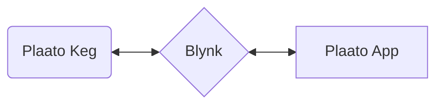
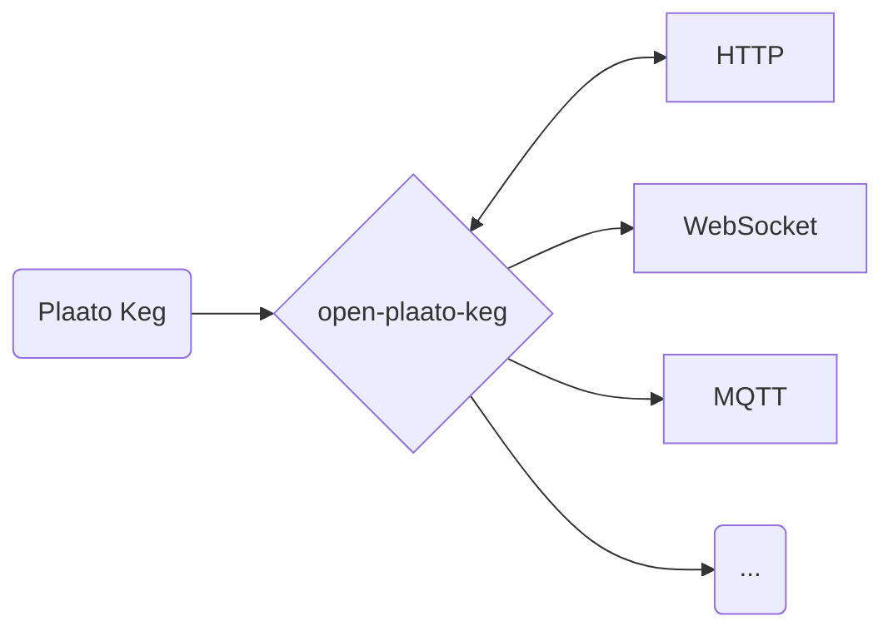

## What is Open Plaato Keg?

Take control of your Plaato Keg! This reverse-engineered solution bypasses the Plaato cloud, keeping your keg data local and accessible even after the cloud service is discontinued.

## 🆕 Next Branch - New Features and Changes

The `next` branch contains upcoming features that are still in development. Install using the `next` Docker tag:

```bash
docker run --rm -it -p 1234:1234 -p 8085:8085 ghcr.io/sklopivo/open-plaato-keg:next
```

### New Features

- **Multi-Architecture Docker Images** - Native support for `linux/amd64` and `linux/arm64` (Raspberry Pi 4/5, Apple Silicon, AWS Graviton)

- **Keg Setup Page (`/setup.html`)** - Full-featured web UI to configure and control your keg:
  - **Units & Mode**: Switch between Metric/US units, Weight/Volume display mode
  - **Scale Sensitivity**: Adjust pour detection sensitivity (4 levels)
  - **Calibration**: Tare scale, set empty keg weight, calibrate with known weight, temperature offset
  - **Beer Information**: Set beer style, keg date, OG, FG, ABV calculation, max keg volume (stored locally)
  - **System Status**: View device info, WiFi signal, firmware version, chip temperature, leak detection

- **Keg Command API** - New REST endpoints to send commands to connected kegs:
  - `POST /api/kegs/:id/tare` - Tare the scale
  - `POST /api/kegs/:id/empty-keg` - Set empty keg weight
  - `POST /api/kegs/:id/max-keg-volume` - Set max volume
  - `POST /api/kegs/:id/temperature-offset` - Adjust temperature reading
  - `POST /api/kegs/:id/calibrate-known-weight` - Calibrate with known weight
  - `POST /api/kegs/:id/beer-style` - Set beer style name
  - `POST /api/kegs/:id/date` - Set keg date
  - `POST /api/kegs/:id/og` - Set original gravity (format: 1.xxx)
  - `POST /api/kegs/:id/fg` - Set final gravity (format: 1.xxx)
  - `POST /api/kegs/:id/abv` - Calculate ABV from OG and FG
  - `POST /api/kegs/:id/unit` - Set unit system (metric/us)
  - `POST /api/kegs/:id/measure-unit` - Set measure mode (weight/volume)
  - `POST /api/kegs/:id/keg-mode` - Set keg mode (beer/co2) *experimental*
  - `POST /api/kegs/:id/sensitivity` - Set scale sensitivity
  - `GET /api/kegs/connected` - List currently connected kegs

- **Airlocks (fermentation sensors)** - Airlocks are separate from keg scales. Each airlock has its own id (chosen by the device or user). Use **Setup → Airlocks** to set a label (e.g. Primary, Secondary) and optional **Grainfather** integration. API: `GET /api/airlocks`, `GET /api/airlocks/:id`, `POST /api/airlocks/:id/data` (body: `temperature`, `bubbles_per_min`), `POST /api/airlocks/:id/label` (body: `value`), `POST /api/airlocks/:id/grainfather` (body: `enabled`, `unit` "celsius"|"fahrenheit", `specific_gravity`). With Grainfather enabled, airlock data is sent to the Grainfather community web app at most every 15 minutes (temperature, specific gravity, optional bpm).

- **Improved Home Page (`/index.html`)**:
  - Real-time updates via WebSocket
  - Shows beer style and keg date as card title
  - Temperature badge, pouring indicator, last pour, remaining percentage
  - Modern dark theme with amber accents

- **Hardware Calibration** - Tare and calibration commands are sent directly to the keg hardware via Blynk protocol, ensuring accurate readings stored on the device itself

- **Live Pouring Detection** - Real-time `is_pouring` property emitted via WebSocket, enabling instant pour notifications and UI updates

- **Enhanced Data Model** - Decodes all known Plaato Keg pins:
  - Amount left, percent remaining, last pour
  - Temperature (keg and chip)
  - WiFi signal strength, firmware version
  - Leak detection, min/max temperature alerts

### Changes from Master

- Removed old `/config.html` page (replaced by `/setup.html`)
- Removed client-side calibration models (now handled via keg commands)
- Simplified data flow - raw keg data stored directly
- Added `KegCommander` module for bi-directional keg communication
- Added `KegSocketRegistry` to track connected keg sockets
- Prerelease versioning for `next` branch (e.g., `0.0.9-next.1`)

### Experimental Features (⚠️ Use with Caution)

- **CO₂ Mode** - Switch to CO₂ monitoring mode (pins not fully decoded)
- **Scale Sensitivity** - No read feedback from keg for current setting
- **Beer Style/Date/OG/FG/ABV** - Stored in local database (keg doesn't echo these values back)

## Why this exists?

Plaato has decided to stop manufacturing its homebrewing equipment (Airlock, Keg, and Valve). Additionally, the company will shut down the cloud backend that provides data storage and enables the Plaato app to function ([announcement](https://plaato.io/plaato-for-homebrewers/?srsltid=AfmBOop1NiIPtQioYXJ0XWwf53s8FH0wi4M0VTfMo7vrXYixXQ1ITaOk)). This means the app will **cease to work after November 2025**, effectively ending the usability of the devices as they are currently designed.

## How does this work?

The Plaato Keg uses the Blynk cloud platform, configured by Plaato, inivisible to users, for communication. This allows the mobile app to send and receive data from the keg.

### Before:



This local solution decodes the Blynk protocol, giving you the freedom to connect your Plaato Keg with any system or application you choose.

### Now:



## Setup

You need to reset your Plaato Keg to point it to your installation of `open-plaato-keg`. It is done by yellow key provided in the box, or a weak fridge magnet will also do the job.

Reset Steps (copied/compiled) from [here](https://intercom.help/plaato/en/articles/5004706-reset-the-plaato-keg) and [here](https://intercom.help/plaato/en/articles/5004700-how-to-set-up-a-plaato-keg):

1. Power on your Plaato Keg: All three LEDs will light up and blink slowly.
2. Flip your device over and carefully remove the yellow "Reset Key" on the bottom
3. Place the yellow "Reset Key" in the hole marked "Reset" also on the bottom of your Keg and hold it in for around 5 seconds (or place a fridge magnet on top of the two pins under the hole)
4. All three LEDs will turn off and come back on.


Configure steps:
1. Connect to your Plaato Keg - it will now expose Wifi hotspot with named `PLAATO-XXXXX`
2. Go to address http://192.168.4.1
3. Configuration settings will look something like this:

  

4A. Enter your:
  * **WiFi SSID** (beware, Plaato Keg only works on 2.4Ghz networks)
  * (Wifi) **Password**
  * **Auth token** - this is how you will identify your keg if you have more then one - this should be a 32 character hex string (meaning allowed characters are numbers and a-f small letters).
  * **Host** (IP address, or hostname) and **port** (see env variable below -> `KEG_LISTENER_PORT`) should point to your  `open-plaato-keg` installation.

or 4B. Keg can be also configured via this endpoint (simple HTTP GET request with encoded query params):

```
http://192.168.4.1/config?ssid=My+Wifi&pass=my_password&blynk=00000000000000000000000000000001&host=192.168.0.123&port=1234
```

## Deployment

### Docker Images

Docker images are built on Github Container Registry (`ghcr.io`).

**Supported architectures:** `linux/amd64`, `linux/arm64`

This means images work on:
- Standard x86_64 servers and PCs
- Raspberry Pi 4/5 (64-bit OS)
- Apple Silicon Macs (M1/M2/M3)
- AWS Graviton instances

Image:
* `ghcr.io/sklopivo/open-plaato-keg:latest` or tagged by semantic version  - eg. `ghcr.io/sklopivo/open-plaato-keg:x.y.z`


Simple run with defaults (exposing HTTP and binary listener port):

* `docker run --rm -it -p 1234:1234 -p 8085:8085 ghcr.io/sklopivo/open-plaato-keg:latest`

### Docker Compose

Sample docker-compose:

```yaml
version: "3.6"
services:
  open_plaato_keg:
    image: ghcr.io/sklopivo/open-plaato-keg:latest
    container_name: open_plaato_keg
    ports:
      - 1234:1234
      - 8085:8085
    restart: always
    environment:
      - DATABASE_FILE_PATH=/db/keg_data.bin
      - KEG_LISTENER_PORT=1234
      - HTTP_LISTENER_PORT=8085
      - MQTT_ENABLED=true
      - MQTT_HOST=192.168.0.123
      - MQTT_PORT=1883
      - MQTT_USERNAME=mqtt_username
      - MQTT_PASSWORD=mqtt_password
      - MQTT_CLIENT=open_plaato_keg
      - BARHELPER_ENABLED=false
      - BARHELPER_API_KEY=
      - BARHELPER_KEG_MONITOR_MAPPING=plaato-auth-key:barhelper-custom-keg-monitor-id
```

### Elixir releases

If Docker isn't your preferred method, you can create an [Elixir Release](https://hexdocs.pm/mix/Mix.Tasks.Release.html) and run it directly on your server. For managing project versions, using [asdf](https://asdf-vm.com) with the  .tool-versions](.tool-versions)  file is recommended.


### Environment variables

| Name                          | Requirement | Default Value                                                   | Description |
|-------------------------------|-------------|-----------------------------------------------------------------|-------------|
| KEG_LISTENER_PORT             | Optional    | 1234                                                            | TCP port for Plaato Keg connections |
| HTTP_LISTENER_PORT            | Optional    | 8085                                                            | HTTP port for web UI and API |
| DATABASE_FILE_PATH            | Optional    | priv/db/keg_data.bin                                            | Path to persistent database file |
| INCLUDE_UNKNOWN_DATA          | Optional    | false                                                           | Include unknown/undecoded pins in output |
| MQTT_ENABLED                  | Optional    | false                                                            | Enable MQTT publishing |
| MQTT_HOST                     | Optional    | localhost                                                       | MQTT broker hostname |
| MQTT_PORT                     | Optional    | 1883                                                            | MQTT broker port |
| MQTT_USERNAME                 | Optional    | client                                                          | MQTT username |
| MQTT_PASSWORD                 | Optional    | client                                                          | MQTT password |
| MQTT_CLIENT_ID                | Optional    | open_plaato_keg_local                                           | MQTT client identifier |
| MQTT_TOPIC                    | Optional    | plaato/keg                                                      | Base MQTT topic prefix |
| MQTT_JSON_OUTPUT              | Optional    | true                                                            | Publish all data as JSON to `{topic}/{keg_id}` |
| MQTT_PROPERTY_OUTPUT          | Optional    | true                                                            | Publish each property to `{topic}/{keg_id}/{property}` |
| BARHELPER_ENABLED             | Optional    | false                                                           | Enable BarHelper integration |
| BARHELPER_ENDPOINT            | Optional    | https://europe-west1-barhelper-app.cloudfunctions.net/api/customKegMon | BarHelper API endpoint |
| BARHELPER_API_KEY             | Optional    |                                                                 | Your BarHelper API key |
| BARHELPER_UNIT                | Optional    | l                                                               | Unit for BarHelper (l = liters) |
| BARHELPER_KEG_MONITOR_MAPPING | Optional    | plaato-auth-key:barhelper-custom-keg-monitor-id                 | Mapping of Plaato IDs to BarHelper monitors |

#### MQTT Output Modes

**MQTT_JSON_OUTPUT** (default: `true`)
- Publishes the complete keg data as a single JSON object
- Topic: `plaato/keg/{keg_id}`
- Example payload:
  ```json
    {
      "firmware_version": "2.0.10a",
      "chip_temperature_string": "74.44°C",
      "max_temperature": "30.000",
      "min_temperature": "0.000",
      "leak_detection": "0",
      "volume_unit": "litre",
      "wifi_signal_strength": "98",
      "temperature_unit": "°C",
      "beer_left_unit": "litre",
      "keg_temperature_string": "22.87°C",
      "fg": "1010",
      "og": "1050",
      "last_pour": "0.000",
      "keg_temperature": "22.875",
      "is_pouring": "255",
      "percent_of_beer_left": "12.000",
      "last_pour_string": "0.04L",
      "temperature_offset": "-7.500",
      "measure_unit": "2",
      "max_keg_volume": "18.812",
      "empty_keg_weight": "0.000",
      "amount_left": "3.802",
      "unit": "1",
      "internal": {
        "ver": "2.0.10a",
        "tmpl": "TMPL57889",
        "h-beat": "20",
        "fw": "2.0.10a",
        "dev": "ESP32",
        "build": "Jul 20 2020 12:31:35",
        "buff-in": "1024"
      },
      "id": "00000000000000000000000000000001",
      "my_beer_style": "IPA",
      "my_keg_date": "12.01.2025",
      "my_og": "1.050",
      "my_fg": "1.010",
      "my_abv": "5.25"
    }
  ```

**MQTT_PROPERTY_OUTPUT** (default: `false`)
- Publishes each property to a separate subtopic
- Topics: `plaato/keg/{keg_id}/{property_name}`
- Example topics:
  - `plaato/keg/abc123/amount_left` → `15.5`
  - `plaato/keg/abc123/keg_temperature` → `4.2`
  - `plaato/keg/abc123/percent_of_beer_left` → `12.0`
  - `plaato/keg/abc123/my_og` → `1.050`
  - `plaato/keg/abc123/my_fg` → `1.010`
  - `plaato/keg/abc123/my_abv` → `5.25`
- Useful for Home Assistant MQTT discovery or simple automations

Both modes can be enabled simultaneously.


## Integrations

### Web Companion

Showcase how to interact with WebSocket and REST API.

### `/index.html`

* Displays your keg values in real time with WebSocket updates
* Shows beer style, keg date, temperature, pouring status, and remaining volume

### `/setup.html`

* Configure and control your kegs
* Set units, calibration, beer information, and view system status
* Send commands directly to connected kegs

### HTTP REST API

### `/api/kegs`

* **Method:** `GET`
* **Description:** Retrieves a list of all kegs connected to the Plaato Keg device.
* **Response:** An array of JSON objects, each representing a keg.
   * **Example Response:**
      ```json
        [
           {
              "firmware_version": "2.0.10a",
              "chip_temperature_string": "74.44°C",
              "max_temperature": "30.000",
              "min_temperature": "0.000",
              "leak_detection": "0",
              "volume_unit": "litre",
              "wifi_signal_strength": "98",
              "temperature_unit": "°C",
              "beer_left_unit": "litre",
              "keg_temperature_string": "22.87°C",
              "fg": "1010",
              "og": "1050",
              "last_pour": "0.000",
              "keg_temperature": "22.875",
              "is_pouring": "255",
              "percent_of_beer_left": "12.000",
              "last_pour_string": "0.04L",
              "temperature_offset": "-7.500",
              "measure_unit": "2",
              "max_keg_volume": "18.812",
              "empty_keg_weight": "0.000",
              "amount_left": "3.802",
              "unit": "1",
              "internal": {
                "ver": "2.0.10a",
                "tmpl": "TMPL57889",
                "h-beat": "20",
                "fw": "2.0.10a",
                "dev": "ESP32",
                "build": "Jul 20 2020 12:31:35",
                "buff-in": "1024"
              },
              "id": "00000000000000000000000000000001",
              "my_beer_style": "IPA",
              "my_keg_date": "12.01.2025",
              "my_og": "1.050",
              "my_fg": "1.010",
              "my_abv": "5.25"
            }
        ]
      ```
* **Fields in Response:**
    * `id`: Unique identifier for the keg (32-character hex string from auth token)
    * `amount_left`: Current amount of beer left in the keg
    * `percent_of_beer_left`: Percentage of beer remaining (0-100)
    * `max_keg_volume`: Maximum keg volume
    * `empty_keg_weight`: Weight of the empty keg
    * `last_pour`: Amount of the last pour
    * `last_pour_string`: Formatted last pour with unit
    * `is_pouring`: Pour status (0 = not pouring, non-zero = pouring)
    * `keg_temperature`: Current keg temperature
    * `keg_temperature_string`: Formatted temperature with unit
    * `temperature_offset`: Temperature calibration offset
    * `chip_temperature_string`: ESP32 chip temperature
    * `unit`: Unit system (1 = Metric, 2 = US)
    * `measure_unit`: Measure mode setting
    * `beer_left_unit`: Display unit for beer amount (litre, kg, gal, lbs)
    * `volume_unit`: Volume unit setting
    * `temperature_unit`: Temperature unit (°C or °F)
    * `wifi_signal_strength`: WiFi signal strength percentage
    * `firmware_version`: Keg firmware version
    * `leak_detection`: Leak detection status
    * `min_temperature` / `max_temperature`: Temperature alert thresholds
    * `og` / `fg`: Original and final gravity values (from hardware)
    * `internal`: System info object (dev, ver, fw, build, tmpl, h-beat, buff-in)
    * `my_beer_style`: User-defined beer style (stored locally)
    * `my_keg_date`: User-defined keg date (stored locally)
    * `my_og`: User-defined original gravity in format 1.xxx (stored locally)
    * `my_fg`: User-defined final gravity in format 1.xxx (stored locally)
    * `my_abv`: Calculated ABV percentage from OG and FG (stored locally)

### `/api/kegs/{keg_id}`

* **Method:** `GET`
* **Description:** Retrieves details for a specific keg.
* **Path Parameter:**
    *  `keg_id`: The unique ID of the keg.
* **Response:** A JSON object representing the keg.
    * **Example Response:**
       ```json
        {
            "firmware_version": "2.0.10a",
            "chip_temperature_string": "74.44°C",
            "max_temperature": "30.000",
            "min_temperature": "0.000",
            "leak_detection": "0",
            "volume_unit": "litre",
            "wifi_signal_strength": "98",
            "temperature_unit": "°C",
            "beer_left_unit": "litre",
            "keg_temperature_string": "22.87°C",
            "fg": "1010",
            "og": "1050",
            "last_pour": "0.000",
            "keg_temperature": "22.875",
            "is_pouring": "255",
            "percent_of_beer_left": "12.000",
            "last_pour_string": "0.04L",
            "temperature_offset": "-7.500",
            "measure_unit": "2",
            "max_keg_volume": "18.812",
            "empty_keg_weight": "0.000",
            "amount_left": "3.802",
            "unit": "1",
            "internal": {
              "ver": "2.0.10a",
              "tmpl": "TMPL57889",
              "h-beat": "20",
              "fw": "2.0.10a",
              "dev": "ESP32",
              "build": "Jul 20 2020 12:31:35",
              "buff-in": "1024"
            },
            "id": "00000000000000000000000000000001",
            "my_beer_style": "IPA",
            "my_keg_date": "12.01.2025",
            "my_og": "1.050",
            "my_fg": "1.010",
            "my_abv": "5.25"
        }
       ```
* **Fields in Response:** Same as `/api/kegs`

### `/api/kegs/devices`

* **Method:** `GET`
* **Description:**  Retrieves a list of the device IDs connected/offline in the Plaato Keg system.
* **Response:** An array of strings, where each string is a device ID.
   * **Example Response:**
      ```json
      ["00000000000000000000000000000001"]
      ```

### `/api/metrics`

* **Method:** `GET`
* **Description:** Exposes metrics in Prometheus format
* **Response**: `plaato_keg_weight` and `plaato_keg_temperature` are exposed alongside with Elixir metrics.

```
plaato_keg{id="00000000000000000000000000000001",type="keg_temperature"} 23.0
plaato_keg{id="00000000000000000000000000000001",type="leak_detection"} 0.0
plaato_keg{id="00000000000000000000000000000001",type="og"} 1.0e3
plaato_keg{id="00000000000000000000000000000001",type="max_keg_volume"} 19.0
plaato_keg{id="00000000000000000000000000000001",type="last_pour"} 0.0
plaato_keg{id="00000000000000000000000000000001",type="amount_left"} -0.1
plaato_keg{id="00000000000000000000000000000001",type="max_temperature"} 30.0
plaato_keg{id="00000000000000000000000000000001",type="min_temperature"} 0.0
plaato_keg{id="00000000000000000000000000000001",type="temperature_offset"} -7.5
plaato_keg{id="00000000000000000000000000000001",type="empty_keg_weight"} 0.0
plaato_keg{id="00000000000000000000000000000001",type="measure_unit"} 2.0
plaato_keg{id="00000000000000000000000000000001",type="fg"} 1.0e3
plaato_keg{id="00000000000000000000000000000001",type="percent_of_beer_left"} 0.0
plaato_keg{id="00000000000000000000000000000001",type="wifi_signal_strength"} 88.0
plaato_keg{id="00000000000000000000000000000001",type="unit"} 1.0
plaato_keg{id="00000000000000000000000000000001",type="is_pouring"} 0.0
```

### `/api/alive`

* **Method:** `GET`
* **Description:** Returns if webserver is started
* **Response**: `200 OK` with body "1"

### WebSocket

All updates can be received via websocket.

```javascript
 const socket = new WebSocket('/ws');
 socket.addEventListener('message', (event) => {
    const updatedKeg = JSON.parse(event.data);
 }
```

Message is in the same format as in API calls.

### MQTT (optional)

If enabled, `open-plaato-keg` can send updates to MQTT topic. Updates are the same model as REST API call (JSON), and will be published on `plaato/keg/{keg_id}` topic (prefix is changable by `MQTT_TOPIC` env variable). See `MQTT_*` environment variables.


### BarHelper (optional)

If enabled `open-plaato-keg` can send updates to [BarHelper](`https://barhelper.no`) via *Custom Keg Monitor* integration.

Steps:
1. Refer to the documentation `https://docs.barhelper.app/english/settings/custom-keg-monitor` and create Custom Keg Monitor and take note of the `Id Number` and your `API key`

Environment variables to set:

* `BARHELPER_ENABLED=true`
* `BARHELPER_ENDPOINT` - you can leave the default (https://europe-west1-barhelper-app.cloudfunctions.net/api/customKegMon)
* `BARHELPER_API_KEY` - your API key
* `BARHELPER_UNIT`- you can leave the default if it is liters
* `BARHELPER_KEG_MONITOR_MAPPING`
  * configuration in CSV key-value format:
    *  "plaato-auth-key:barhelper-custom-keg-monitor-id,plaato-auth-key:barhelper-custom-keg-monitor-id"
    * eg. "00000000000000000000000000000001:custom-1"

