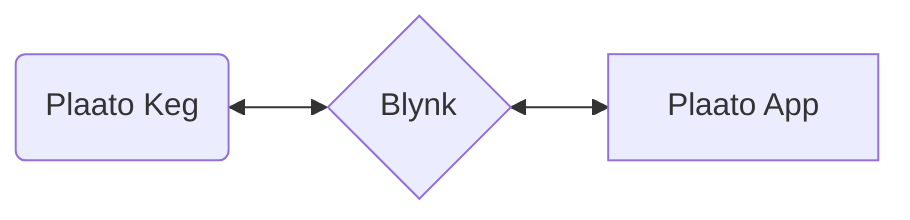
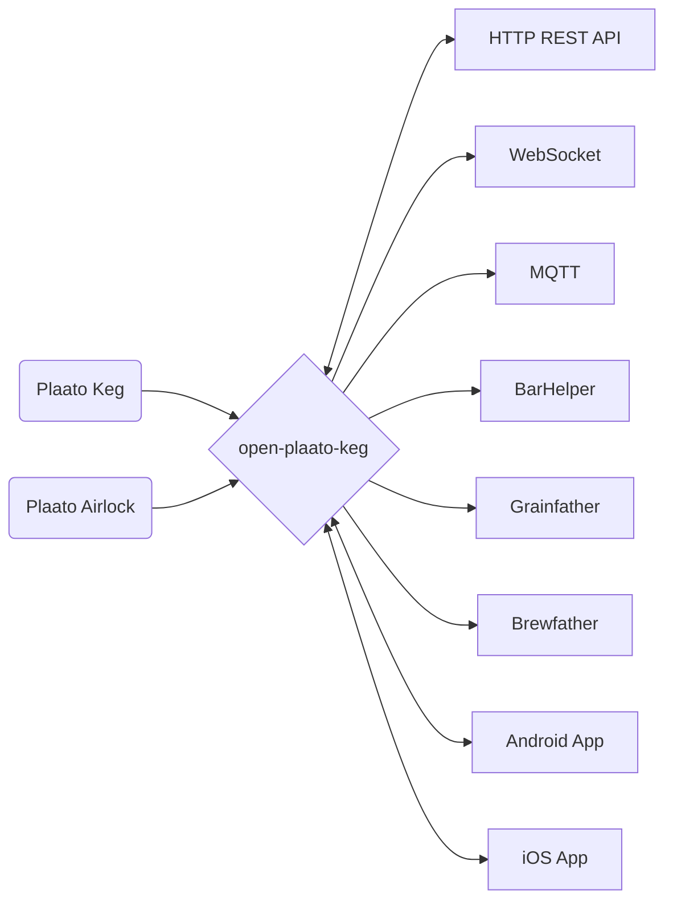

<a href="https://www.buymeacoffee.com/LocutusOFB"></a>
## What is Open Plaato Keg?

Take control of your Plaato Keg and Plaato Airlock! This reverse-engineered solution bypasses the Plaato cloud, keeping your device data local and accessible even after the cloud service is discontinued.

Supports:
- **Plaato Keg** — scale-based keg monitor with pour detection, temperature, and calibration
- **Plaato Airlock** — fermentation sensor with bubble count (BPM) and temperature
- **Generic airlocks** — any device that can POST to `/api/airlocks/:id/data`
- **Android companion app** — native app for monitoring kegs and airlocks from your phone ([open-plaato-keg-android](https://github.com/DarkJaeger/open-plaato-keg-android))
- **iOS companion app** — SwiftUI app for iPhone and iPad ([open-plaato-keg-ios](https://github.com/DarkJaeger/open-plaato-keg-ios))

## Why this exists?

Plaato has decided to stop manufacturing its homebrewing equipment (Airlock, Keg, and Valve). Additionally, the company will shut down the cloud backend that provides data storage and enables the Plaato app to function ([announcement](https://plaato.io/plaato-for-homebrewers/?srsltid=AfmBOop1NiIPtQioYXJ0XWwf53s8FH0wi4M0VTfMo7vrXYixXQ1ITaOk)). This means the app will **cease to work after November 2025**, effectively ending the usability of the devices as they are currently designed.

## How does this work?

The Plaato Keg uses the Blynk cloud platform, configured by Plaato, inivisible to users, for communication. This allows the mobile app to send and receive data from the keg.

### Before:


```mermaid
graph LR
    A(Plaato Keg) <--> B{Blynk};
    B <--> C[Plaato App];
```

This local solution decodes the Blynk protocol, giving you the freedom to connect your Plaato Keg with any system or application you choose.

### Now:


```mermaid
graph LR
    A(Plaato Keg) --> B{open-plaato-keg};
    G(Plaato Airlock) --> B;
    B <--> C[HTTP REST API];
    B --> D[WebSocket];
    B --> E[MQTT];
    B --> F[BarHelper];
    B --> H[Grainfather];
    B --> I[Brewfather];
    B <--> J[Android App];
    B <--> K[iOS App];
```

## Setup

### Plaato Keg

You need to reset your Plaato Keg to point it to your installation of `open-plaato-keg`. It is done by yellow key provided in the box, or a weak fridge magnet will also do the job.

Reset Steps (copied/compiled) from [here](https://intercom.help/plaato/en/articles/5004706-reset-the-plaato-keg) and [here](https://intercom.help/plaato/en/articles/5004700-how-to-set-up-a-plaato-keg):

1. Power on your Plaato Keg: All three LEDs will light up and blink slowly.
2. Flip your device over and carefully remove the yellow "Reset Key" on the bottom
3. Place the yellow "Reset Key" in the hole marked "Reset" also on the bottom of your Keg and hold it in for around 5 seconds (or place a fridge magnet on top of the two pins under the hole)
4. All three LEDs will turn off and come back on.


Configure steps:
1. Connect to your Plaato Keg - it will now expose Wifi hotspot with named `PLAATO-XXXXX`
2. Go to address http://192.168.4.1
3. Configuration settings will look something like this:

  

4A. Enter your:
  * **WiFi SSID** (beware, Plaato Keg only works on 2.4Ghz networks)
  * (Wifi) **Password**
  * **Auth token** - this is how you will identify your keg if you have more then one - this should be a 32 character hex string (meaning allowed characters are numbers and a-f small letters).
  * **Host** (IP address, or hostname) and **port** (see env variable below -> `KEG_LISTENER_PORT`) should point to your  `open-plaato-keg` installation.

or 4B. Keg can be also configured via this endpoint (simple HTTP GET request with encoded query params):

```
http://192.168.4.1/config?ssid=My+Wifi&pass=my_password&blynk=00000000000000000000000000000001&host=192.168.0.123&port=1234
```

### Plaato Airlock

The Plaato Airlock uses the same Blynk TCP protocol as the Keg, connecting to the same port (default: 1234). Configure it the same way as the Keg (reset, connect to hotspot, set host/port). The auth token you configure becomes the airlock's ID.

`open-plaato-keg` automatically detects whether an incoming TCP connection is from a Keg or an Airlock based on the virtual pins it sends:

| Virtual Pin | Property | Description |
|---|---|---|
| V99 | `error` | Error status |
| V100 | `bubbles_per_min` | Cumulative bubble count (BPM derived from delta between readings) |
| V101 | `temperature` | Fermentation temperature |

Once connected, the airlock appears in the **Airlocks** section of the web UI.

## Deployment

### Docker Images

Docker images are built on Github Container Registry (`ghcr.io`).

**Supported architectures:** `linux/amd64`, `linux/arm64`

This means images work on:
- Standard x86_64 servers and PCs
- Raspberry Pi 4/5 (64-bit OS)
- Apple Silicon Macs (M1/M2/M3)
- AWS Graviton instances

Image:
* `ghcr.io/darkjaeger/open-plaato-keg:latest` — latest stable release
* `ghcr.io/darkjaeger/open-plaato-keg:x.y.z` — pinned semantic version

Simple run with defaults (exposing HTTP and binary listener port):

```bash
docker run --rm -it -p 1234:1234 -p 8085:8085 ghcr.io/darkjaeger/open-plaato-keg:latest
```

### Docker Compose

Sample docker-compose:

```yaml
version: "3.6"
services:
  open_plaato_keg:
    image: ghcr.io/darkjaeger/open-plaato-keg:latest
    container_name: open_plaato_keg
    ports:
      - 1234:1234
      - 8085:8085
    restart: always
    volumes:
      # Persist the database across container updates — without this your
      # keg data will be lost every time the container is recreated.
      # Unraid users: change the host path to your appdata share, e.g.
      #   /mnt/user/appdata/open-plaato-keg:/db
      - ./data:/db
    environment:
      - DATABASE_FILE_PATH=/db/keg_data.bin
      - KEG_LISTENER_PORT=1234
      - HTTP_LISTENER_PORT=8085
      - MQTT_ENABLED=true
      - MQTT_HOST=192.168.0.123
      - MQTT_PORT=1883
      - MQTT_USERNAME=mqtt_username
      - MQTT_PASSWORD=mqtt_password
      - MQTT_CLIENT=open_plaato_keg
      - BARHELPER_ENABLED=false
      - BARHELPER_API_KEY=
      - BARHELPER_KEG_MONITOR_MAPPING=plaato-auth-key:barhelper-custom-keg-monitor-id
```

### Elixir releases

If Docker isn't your preferred method, you can create an [Elixir Release](https://hexdocs.pm/mix/Mix.Tasks.Release.html) and run it directly on your server. For managing project versions, using [asdf](https://asdf-vm.com) with the  .tool-versions](.tool-versions)  file is recommended.


### Environment variables

| Name                          | Requirement | Default Value                                                   | Description |
|-------------------------------|-------------|-----------------------------------------------------------------|-------------|
| KEG_LISTENER_PORT             | Optional    | 1234                                                            | TCP port for Plaato Keg connections |
| HTTP_LISTENER_PORT            | Optional    | 8085                                                            | HTTP port for web UI and API |
| DATABASE_FILE_PATH            | Optional    | priv/db/keg_data.bin                                            | Path to persistent database file |
| INCLUDE_UNKNOWN_DATA          | Optional    | false                                                           | Include unknown/undecoded pins in output |
| MQTT_ENABLED                  | Optional    | false                                                            | Enable MQTT publishing |
| MQTT_HOST                     | Optional    | localhost                                                       | MQTT broker hostname |
| MQTT_PORT                     | Optional    | 1883                                                            | MQTT broker port |
| MQTT_USERNAME                 | Optional    | client                                                          | MQTT username |
| MQTT_PASSWORD                 | Optional    | client                                                          | MQTT password |
| MQTT_CLIENT_ID                | Optional    | open_plaato_keg_local                                           | MQTT client identifier |
| MQTT_TOPIC                    | Optional    | plaato/keg                                                      | Base MQTT topic prefix |
| MQTT_JSON_OUTPUT              | Optional    | true                                                            | Publish all data as JSON to `{topic}/{keg_id}` |
| MQTT_PROPERTY_OUTPUT          | Optional    | true                                                            | Publish each property to `{topic}/{keg_id}/{property}` |
| BARHELPER_ENABLED             | Optional    | false                                                           | Enable BarHelper integration |
| BARHELPER_ENDPOINT            | Optional    | https://europe-west1-barhelper-app.cloudfunctions.net/api/customKegMon | BarHelper API endpoint |
| BARHELPER_API_KEY             | Optional    |                                                                 | Your BarHelper API key |
| BARHELPER_UNIT                | Optional    | l                                                               | Unit for BarHelper (l = liters) |
| BARHELPER_KEG_MONITOR_MAPPING | Optional    | plaato-auth-key:barhelper-custom-keg-monitor-id                 | Mapping of Plaato IDs to BarHelper monitors |

#### MQTT Output Modes

**MQTT_JSON_OUTPUT** (default: `true`)
- Publishes the complete keg data as a single JSON object
- Topic: `plaato/keg/{keg_id}`
- Example payload:
  ```json
    {
      "firmware_version": "2.0.10a",
      "chip_temperature_string": "74.44°C",
      "max_temperature": "30.000",
      "min_temperature": "0.000",
      "leak_detection": "0",
      "volume_unit": "litre",
      "wifi_signal_strength": "98",
      "temperature_unit": "°C",
      "beer_left_unit": "litre",
      "keg_temperature_string": "22.87°C",
      "fg": "1010",
      "og": "1050",
      "last_pour": "0.000",
      "keg_temperature": "22.875",
      "is_pouring": "255",
      "percent_of_beer_left": "12.000",
      "last_pour_string": "0.04L",
      "temperature_offset": "-7.500",
      "measure_unit": "2",
      "max_keg_volume": "18.812",
      "empty_keg_weight": "0.000",
      "amount_left": "3.802",
      "unit": "1",
      "internal": {
        "ver": "2.0.10a",
        "tmpl": "TMPL57889",
        "h-beat": "20",
        "fw": "2.0.10a",
        "dev": "ESP32",
        "build": "Jul 20 2020 12:31:35",
        "buff-in": "1024"
      },
      "id": "00000000000000000000000000000001",
      "my_label": "Basement Tap",
      "my_beer_style": "IPA",
      "my_keg_date": "12.01.2025",
      "my_og": "1.050",
      "my_fg": "1.010",
      "my_abv": "5.25"
    }
  ```

**MQTT_PROPERTY_OUTPUT** (default: `false`)
- Publishes each property to a separate subtopic
- Topics: `plaato/keg/{keg_id}/{property_name}`
- Example topics:
  - `plaato/keg/abc123/amount_left` → `15.5`
  - `plaato/keg/abc123/keg_temperature` → `4.2`
  - `plaato/keg/abc123/percent_of_beer_left` → `12.0`
  - `plaato/keg/abc123/my_og` → `1.050`
  - `plaato/keg/abc123/my_fg` → `1.010`
  - `plaato/keg/abc123/my_abv` → `5.25`
- Useful for Home Assistant MQTT discovery or simple automations

Both modes can be enabled simultaneously.


## Integrations

### Web UI

The web UI is served on the configured HTTP port. All pages update in real time via WebSocket.

#### `/index.html` — Tap List

Displays your configured tap list with live keg data:
- Tap cards show: tap name, beer name and brewery, keg label, pour status, last pour amount, and remaining volume with progress bar
- Tap handle images are shown if configured
- Links to the tap setup page for editing

#### `/taplist-setup.html` — Tap Setup

Configure your tap list:
- Create and edit taps — assign a name, keg, brewery, beer style, description, tasting notes, and ABV
- Load beer details from the beverage library
- Upload and assign tap handle images

#### `/setup.html` — Keg Setup

Configure and control connected kegs:
- Set units (metric/imperial), measure mode (weight/volume), sensitivity, and keg mode
- Calibrate the scale, set empty keg weight, and adjust temperature offset
- Set beer information (style, date, OG, FG, ABV) and a friendly keg label
- View live keg status

#### `/airlock-setup.html` — Airlock Setup

Configure airlocks and fermentation integrations:
- Enable/disable airlock support
- Set a friendly label per airlock device
- Configure [Grainfather](#grainfather-optional) and [Brewfather](#brewfather-optional) forwarding per airlock

#### `/beverages.html` — Beverage Library

Manage a library of beers and beverages to reuse across tap setups:
- Add, edit, and delete beverages with name, brewery, style, ABV, IBU, OG, FG, SRM color, description, and tasting notes
- Import directly from Brewfather batches (requires Brewfather credentials in Settings)

### Android Companion App

A native Android app is available at [open-plaato-keg-android](https://github.com/DarkJaeger/open-plaato-keg-android).

Features:
- Live tap list with keg data updated via WebSocket
- Keg scale configuration and calibration
- Airlock monitoring with BPM and temperature
- Beverage library management with Brewfather batch import
- Pour notifications — fires a local notification when a pour is detected (configurable, ≥ 5 oz threshold to suppress scale noise)
- Settings for server URL, airlock support, and Brewfather credentials

### iOS Companion App

A native SwiftUI app for iPhone and iPad is available at [open-plaato-keg-ios](https://github.com/DarkJaeger/open-plaato-keg-ios).

Requires iOS 16+ and an `open-plaato-keg` server running on your local network.

Features:
- Live tap list with keg levels, temperature, and pour status
- Full keg details with beer info
- Airlock monitoring with BPM and temperature readings
- Beverage library management
- Configurable server URL via Settings tab

### HTTP REST API

#### `/api/config`

* **Method:** `GET`
* **Description:** Returns the current server-side app configuration.
* **Response:**
  ```json
  { "airlock_enabled": true }
  ```

#### `POST /api/config/airlock-enabled`

* **Description:** Enable or disable Plaato Airlock support.
* **Body:** `{ "enabled": true }`

### `/api/kegs`

* **Method:** `GET`
* **Description:** Retrieves a list of all kegs connected to the Plaato Keg device.
* **Response:** An array of JSON objects, each representing a keg.
   * **Example Response:**
      ```json
        [
           {
              "firmware_version": "2.0.10a",
              "chip_temperature_string": "74.44°C",
              "max_temperature": "30.000",
              "min_temperature": "0.000",
              "leak_detection": "0",
              "volume_unit": "litre",
              "wifi_signal_strength": "98",
              "temperature_unit": "°C",
              "beer_left_unit": "litre",
              "keg_temperature_string": "22.87°C",
              "fg": "1010",
              "og": "1050",
              "last_pour": "0.000",
              "keg_temperature": "22.875",
              "is_pouring": "255",
              "percent_of_beer_left": "12.000",
              "last_pour_string": "0.04L",
              "temperature_offset": "-7.500",
              "measure_unit": "2",
              "max_keg_volume": "18.812",
              "empty_keg_weight": "0.000",
              "amount_left": "3.802",
              "unit": "1",
              "internal": {
                "ver": "2.0.10a",
                "tmpl": "TMPL57889",
                "h-beat": "20",
                "fw": "2.0.10a",
                "dev": "ESP32",
                "build": "Jul 20 2020 12:31:35",
                "buff-in": "1024"
              },
              "id": "00000000000000000000000000000001",
              "my_beer_style": "IPA",
              "my_keg_date": "12.01.2025",
              "my_og": "1.050",
              "my_fg": "1.010",
              "my_abv": "5.25"
            }
        ]
      ```
* **Fields in Response:**
    * `id`: Unique identifier for the keg (32-character hex string from auth token)
    * `amount_left`: Current amount of beer left in the keg
    * `percent_of_beer_left`: Percentage of beer remaining (0-100)
    * `max_keg_volume`: Maximum keg volume
    * `empty_keg_weight`: Weight of the empty keg
    * `last_pour`: Amount of the last pour
    * `last_pour_string`: Formatted last pour with unit
    * `is_pouring`: Pour status (0 = not pouring, non-zero = pouring)
    * `keg_temperature`: Current keg temperature
    * `keg_temperature_string`: Formatted temperature with unit
    * `temperature_offset`: Temperature calibration offset
    * `chip_temperature_string`: ESP32 chip temperature
    * `unit`: Unit system (1 = Metric, 2 = US)
    * `measure_unit`: Measure mode setting
    * `beer_left_unit`: Display unit for beer amount (litre, kg, gal, lbs)
    * `volume_unit`: Volume unit setting
    * `temperature_unit`: Temperature unit (°C or °F)
    * `wifi_signal_strength`: WiFi signal strength percentage
    * `firmware_version`: Keg firmware version
    * `leak_detection`: Leak detection status
    * `min_temperature` / `max_temperature`: Temperature alert thresholds
    * `og` / `fg`: Original and final gravity values (from hardware)
    * `internal`: System info object (dev, ver, fw, build, tmpl, h-beat, buff-in)
    * `my_label`: User-defined friendly keg name, shown on the dashboard (stored locally)
    * `my_beer_style`: User-defined beer style (stored locally)
    * `my_keg_date`: User-defined keg date (stored locally)
    * `my_og`: User-defined original gravity in format 1.xxx (stored locally)
    * `my_fg`: User-defined final gravity in format 1.xxx (stored locally)
    * `my_abv`: Calculated ABV percentage from OG and FG (stored locally)

### `/api/kegs/{keg_id}`

* **Method:** `GET`
* **Description:** Retrieves details for a specific keg.
* **Path Parameter:**
    *  `keg_id`: The unique ID of the keg.
* **Response:** A JSON object representing the keg (same fields as `/api/kegs`).

### `/api/kegs/devices`

* **Method:** `GET`
* **Description:**  Retrieves a list of the device IDs connected/offline in the Plaato Keg system.
* **Response:** An array of strings, where each string is a device ID.
   * **Example Response:**
      ```json
      ["00000000000000000000000000000001"]
      ```

### `/api/kegs/connected`

* **Method:** `GET`
* **Description:** Lists kegs with an active TCP connection right now.
* **Response:** Array of keg ID strings.

### Keg Command Endpoints

Send commands to a connected keg:

| Endpoint | Body | Description |
|---|---|---|
| `POST /api/kegs/:id/tare` | — | Tare the scale |
| `POST /api/kegs/:id/tare-release` | — | Release tare |
| `POST /api/kegs/:id/empty-keg` | — | Store current scale reading as empty keg reference |
| `POST /api/kegs/:id/empty-keg-release` | — | Release empty keg |
| `POST /api/kegs/:id/empty-keg-weight` | `{"value": 4.0}` | Set empty keg reference weight directly (kg or lbs) |
| `POST /api/kegs/:id/max-keg-volume` | `{"value": 19.5}` | Set max keg volume |
| `POST /api/kegs/:id/temperature-offset` | `{"value": -2.5}` | Adjust temperature calibration offset |
| `POST /api/kegs/:id/calibrate-known-weight` | `{"value": 5000}` | Calibrate with known weight (grams) |
| `POST /api/kegs/:id/reset-last-pour` | — | Reset last pour value to zero |
| `POST /api/kegs/:id/unit` | `{"value": "metric"\|"us"}` | Set unit system (immediately updates display units) |
| `POST /api/kegs/:id/measure-unit` | `{"value": "weight"\|"volume"}` | Set measure mode (immediately updates display units) |
| `POST /api/kegs/:id/keg-mode` | `{"value": "beer"\|"co2"}` | Set keg mode *(experimental)* |
| `POST /api/kegs/:id/sensitivity` | `{"value": "low"\|"medium"\|"high"\|"very_low"}` | Set pour detection sensitivity |
| `POST /api/kegs/:id/label` | `{"value": "Basement Tap"}` | Set friendly keg label (stored locally) |
| `POST /api/kegs/:id/beer-style` | `{"value": "IPA"}` | Set beer style (stored locally + sent to keg) |
| `POST /api/kegs/:id/date` | `{"value": "01.01.2025"}` | Set keg date (stored locally + sent to keg) |
| `POST /api/kegs/:id/og` | `{"value": "1.050"}` | Set original gravity (stored locally) |
| `POST /api/kegs/:id/fg` | `{"value": "1.010"}` | Set final gravity (stored locally) |
| `POST /api/kegs/:id/abv` | `{"og": "1.050", "fg": "1.010"}` | Calculate & store ABV |
| `POST /api/kegs/:id/delete` | — | Remove a keg's stored data |

### Airlock REST API

#### `/api/airlocks`

* **Method:** `GET`
* **Description:** Retrieves data for all known airlocks.
* **Response:** Array of airlock objects.
   * **Example Response:**
      ```json
      [
        {
          "id": "my-airlock-1",
          "label": "Primary",
          "temperature": "20.5",
          "bubbles_per_min": "2.3",
          "error": "0"
        }
      ]
      ```

#### `/api/airlocks/:id`

* **Method:** `GET`
* **Description:** Retrieves data for a single airlock.
* **Response:** Airlock object, or `404` if not found.

#### `/api/airlocks/:id/data`

* **Method:** `POST`
* **Description:** Submit temperature and/or BPM for an airlock. At least one field required.
* **Body:**
  ```json
  { "temperature": "20.5", "bubbles_per_min": "2.3" }
  ```

#### `/api/airlocks/:id/label`

* **Method:** `POST`
* **Description:** Set a human-readable label for the airlock.
* **Body:** `{ "value": "Primary" }`

#### `/api/airlocks/:id/grainfather`

* **Method:** `POST`
* **Description:** Configure Grainfather integration for this airlock.
* **Body:**
  ```json
  { "enabled": true, "unit": "celsius", "specific_gravity": "1.050", "url": "https://local.community.grainfather.com/iot/.../custom" }
  ```
* `url` is the per-airlock Grainfather endpoint URL (found in your Grainfather session). Sending is skipped if the URL is not set.
* When enabled, airlock data is forwarded to the Grainfather community web app at most once every 15 minutes (requires temperature; BPM is optional).

#### `/api/airlocks/:id/brewfather`

* **Method:** `POST`
* **Description:** Configure Brewfather custom stream forwarding for this airlock.
* **Body:**
  ```json
  { "enabled": true, "unit": "celsius", "specific_gravity": "1.050", "og": "1.060", "batch_volume": "20.0", "url": "https://log.brewfather.net/stream?id=..." }
  ```
* `url` is the per-airlock Brewfather custom stream URL (found in your Brewfather batch). Sending is skipped if the URL is not set.
* When enabled, temperature and BPM data are forwarded to Brewfather at most once every 15 minutes.

### Tap List API

#### `/api/taps`

* **Method:** `GET`
* **Description:** Returns all configured taps.
* **Response:** Array of tap objects.

#### `/api/taps/:id`

* **Method:** `GET` / `POST`
* **Description:** Get or save a tap. Use `id = "new"` to create a new tap.
* **Body (POST):**
  ```json
  {
    "name": "Basement Tap",
    "tap_number": 1,
    "keg_id": "00000000000000000000000000000001",
    "brewery": "Home Brew Co",
    "description": "A hoppy IPA",
    "tasting_notes": "Citrus, pine",
    "abv": "5.5",
    "handle_image": "my-tap.jpg"
  }
  ```

#### `/api/taps/:id/delete`

* **Method:** `POST`
* **Description:** Delete a tap.

#### `/api/tap-handles`

* **Method:** `GET`
* **Description:** Returns a list of uploaded tap handle image filenames.

#### `POST /api/tap-handles/upload`

* **Description:** Upload a tap handle image (multipart form, field `file`). Returns the stored filename.

#### `POST /api/tap-handles/:filename/delete`

* **Description:** Delete an uploaded tap handle image.

#### `GET /uploads/tap-handles/:filename`

* **Description:** Serves uploaded tap handle images.

### Beverage Library API

#### `/api/beverages`

* **Method:** `GET`
* **Description:** Returns all beverages in the library.
* **Response:** Array of beverage objects.

#### `/api/beverages/:id`

* **Method:** `GET` / `POST`
* **Description:** Get or save a beverage. Use `id = "new"` to create.
* **Body (POST):**
  ```json
  {
    "name": "Session IPA",
    "brewery": "Home Brew Co",
    "style": "IPA",
    "abv": 4.5,
    "ibu": 40,
    "og": 1.048,
    "fg": 1.010,
    "srm": 6,
    "color": "#f5a623",
    "description": "A light, hoppy IPA",
    "tasting_notes": "Citrus, floral"
  }
  ```

#### `POST /api/beverages/:id/delete`

* **Description:** Delete a beverage from the library.

### Brewfather Import API

#### `GET /api/config/brewfather`

* **Description:** Returns whether Brewfather credentials are configured.
* **Response:** `{ "configured": true }`

#### `POST /api/config/brewfather`

* **Description:** Save Brewfather API credentials (stored server-side).
* **Body:** `{ "user_id": "abc123", "api_key": "your-api-key" }`

#### `GET /api/brewfather/batches`

* **Description:** Fetches your Brewfather batch list (requires credentials configured).
* **Response:** Array of batch summaries: `[{ "id": "...", "name": "...", "style": "...", "status": "..." }]`

#### `POST /api/brewfather/import/:batch_id`

* **Description:** Import a Brewfather batch as a beverage in the local library.
* **Response:** The newly created beverage object.

### `/api/metrics`

* **Method:** `GET`
* **Description:** Exposes metrics in Prometheus format
* **Response**: `plaato_keg_weight` and `plaato_keg_temperature` are exposed alongside with Elixir metrics.

```
plaato_keg{id="00000000000000000000000000000001",type="keg_temperature"} 23.0
plaato_keg{id="00000000000000000000000000000001",type="leak_detection"} 0.0
plaato_keg{id="00000000000000000000000000000001",type="og"} 1.0e3
plaato_keg{id="00000000000000000000000000000001",type="max_keg_volume"} 19.0
plaato_keg{id="00000000000000000000000000000001",type="last_pour"} 0.0
plaato_keg{id="00000000000000000000000000000001",type="amount_left"} -0.1
plaato_keg{id="00000000000000000000000000000001",type="max_temperature"} 30.0
plaato_keg{id="00000000000000000000000000000001",type="min_temperature"} 0.0
plaato_keg{id="00000000000000000000000000000001",type="temperature_offset"} -7.5
plaato_keg{id="00000000000000000000000000000001",type="empty_keg_weight"} 0.0
plaato_keg{id="00000000000000000000000000000001",type="measure_unit"} 2.0
plaato_keg{id="00000000000000000000000000000001",type="fg"} 1.0e3
plaato_keg{id="00000000000000000000000000000001",type="percent_of_beer_left"} 0.0
plaato_keg{id="00000000000000000000000000000001",type="wifi_signal_strength"} 88.0
plaato_keg{id="00000000000000000000000000000001",type="unit"} 1.0
plaato_keg{id="00000000000000000000000000000001",type="is_pouring"} 0.0
```

### `/api/alive`

* **Method:** `GET`
* **Description:** Returns if webserver is started
* **Response**: `200 OK` with body containing server version string

### WebSocket

All updates can be received via WebSocket at `/ws`.

```javascript
const socket = new WebSocket('/ws');
socket.addEventListener('message', (event) => {
  const msg = JSON.parse(event.data);

  if (msg.type === 'airlock') {
    // Airlock update: { type: "airlock", data: { id, label, temperature, bubbles_per_min, ... } }
    console.log('Airlock update', msg.data);
  } else {
    // Keg update: full keg object (same format as /api/kegs/:id)
    console.log('Keg update', msg);
  }
});
```

**Keg messages** are the full keg data object (same format as `GET /api/kegs/:id`).

**Airlock messages** have a `type: "airlock"` wrapper:
```json
{
  "type": "airlock",
  "data": {
    "id": "my-airlock-1",
    "label": "Primary",
    "temperature": "20.5",
    "bubbles_per_min": "2.3"
  }
}
```

### MQTT (optional)

If enabled, `open-plaato-keg` can send updates to MQTT topic. Updates are the same model as REST API call (JSON), and will be published on `plaato/keg/{keg_id}` topic (prefix is changable by `MQTT_TOPIC` env variable). See `MQTT_*` environment variables.


### BarHelper (optional)

If enabled `open-plaato-keg` can send updates to [BarHelper](`https://barhelper.no`) via *Custom Keg Monitor* integration.

Steps:
1. Refer to the documentation `https://docs.barhelper.app/english/settings/custom-keg-monitor` and create Custom Keg Monitor and take note of the `Id Number` and your `API key`

Environment variables to set:

* `BARHELPER_ENABLED=true`
* `BARHELPER_ENDPOINT` - you can leave the default (https://europe-west1-barhelper-app.cloudfunctions.net/api/customKegMon)
* `BARHELPER_API_KEY` - your API key
* `BARHELPER_UNIT`- you can leave the default if it is liters
* `BARHELPER_KEG_MONITOR_MAPPING`
  * configuration in CSV key-value format:
    *  "plaato-auth-key:barhelper-custom-keg-monitor-id,plaato-auth-key:barhelper-custom-keg-monitor-id"
    * eg. "00000000000000000000000000000001:custom-1"

### Grainfather (optional)

Per-airlock Grainfather forwarding sends temperature, BPM, and specific gravity to the Grainfather community web app. Configure via `/api/airlocks/:id/grainfather` or the Airlock Setup page. Data is forwarded at most once every 15 minutes per airlock.

### Brewfather (optional)

Per-airlock Brewfather forwarding sends temperature, BPM, specific gravity, and other fermentation data to a Brewfather custom stream URL. Configure via `/api/airlocks/:id/brewfather` or the Airlock Setup page. Data is forwarded at most once every 15 minutes per airlock.

Brewfather batch import allows you to pull batch details from Brewfather into the local beverage library. Configure credentials via the Settings page or `POST /api/config/brewfather`, then browse and import batches via `GET /api/brewfather/batches` and `POST /api/brewfather/import/:batch_id`.
